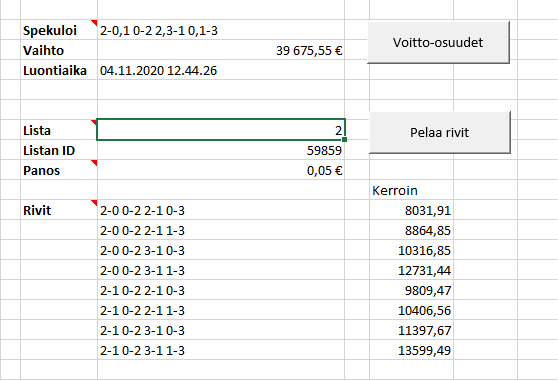

### Excel VBA Ohjeet
Oheinen Robot.xlsm esimerkkitoteutus ohjelmallisesta pelaamisesta. 

#### Koodin muokkaus
VBA makron muokkaus onnistuu Excelin Developer->Visual Basic (Alt-F11) editorilla.

#### Käyttö

Sekä Vakio että Moniveto välilehdeltä löytyvät seuraavat painikkeet: 

**Aika**

Hakee palvelimelta kellonajan, ja testaa näin lomakkeen toimivuuden. 

**Kirjaudu** 

Kirjautuu sisään Veikkauksen palveluun. Tunnus ja salasana syötetään *Tunnus* ja *Salasana* kenttiin. 
Kirjautumalla sisään *Nimi* kenttään päivittyy nimesi (kuten se on tallennettu Veikkauksen palveluun).

**Saldo**

Saldo painikkeella voit hakea pelitilisi saldon *Saldo* kenttään. 

**MV Kohteet** / **Vakio kohteet** 

Näillä painikkeilla voi hakea avoimet pelikohteet. 

**Voitto-osuudet**

Hakee voitto-osuudet järjestelmälle joka on kirjoitettu *Spekuloi* kenttään. Voitto-osuuksien hakemista varten pitää antaa listan numero antaa *Lista* kenttään. Listan numeron saa hakemalla avoimet pelikohteet. 

Vakiolle järjestelmän merkit syötetään väliviivalla eroteltuna. Esimerkiksi järjestelmä Kasivakiolle
(Ottelut 1, 3, 4, 5, 6 ja 8 varmoja. Ottelu 2 täysin vaihdeltu. Ottelu 7 osittain vaihdeltu):
```
1-1X2-2-2-2-1-1X-2
```
Vakiolle voi antaa myös haravan, Spekulointi kentän alla olevista valinnoista pitää valita vastaava haravan takuu ja valintoja vastaava tyyppi. Tarkistuksia ei tehdä joten jos spekulointi ja valinnat eivät vastaa toisiaan, niin voitto-osuushaku ei toimi.

Vakion hajariveille voi tehdä voitto-osuus hakuja, silloin Spekulointi kenttä jätetään tyhjäksi ja hajarivit vain allekkain Rivit kentän kohdalle (johon järjestelmien/haravien hakujen hajarivit tulevat).


Monivedolle järjestelmä syötetään niin että ottelut erotellaan välilyönnillä, joukkueet väliviivalla ja maalit pilkuilla. Esimerkki kolmen ottelun monivedolle (Ensimmäiseen otteluun varma. Toiseen otteluun kotijoukkueelle maaleja 0 tai 1, vierasjoukkueelle 1 tai 2. Kolmanteen otteluun kotijoukkueelle 1 maali, ja vierasjoukkueelle 0 tai 1):
```
0-0 0,1-1,2 1-0,1
```

**Pelaa rivit**

Pelaa rivit jotka on listattu *Rivit* kentän viereen. Rivit voi syöttää käsin, tai esimerkiksi hakemalla voitto-osuudet halutulle järjestelmälle. Vakiolle pelirivin merkit annetaan väliviivalla eroteltuina:

```
1-2-1-2-1-2-1-2-1-1-1-1
```

Monivedolle pelirivin merkit annetaan niin että ottelut erotellaan välilyönnillä ja joukkueet väliviivalla.

```
0-1 1-0 0-2
```

##### Kuvakaappaus Moniveto spekuloinnista


